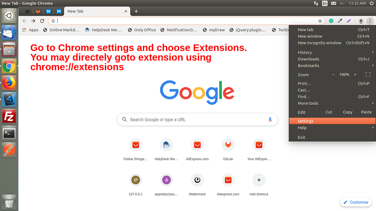
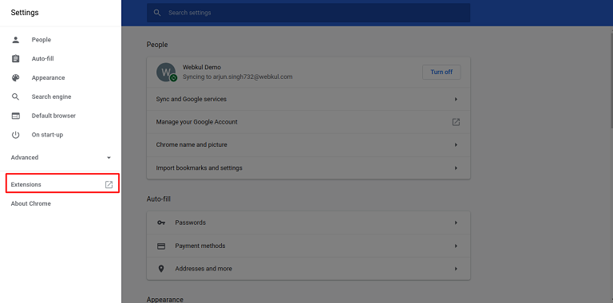
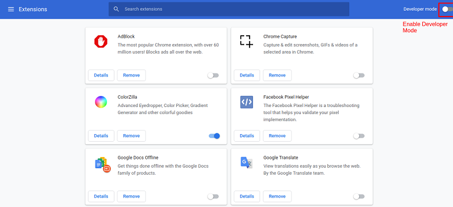
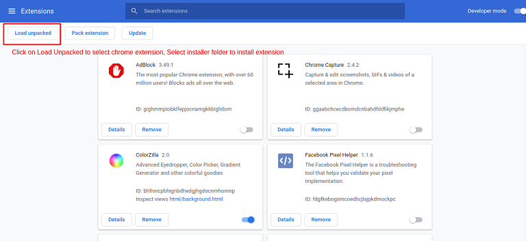
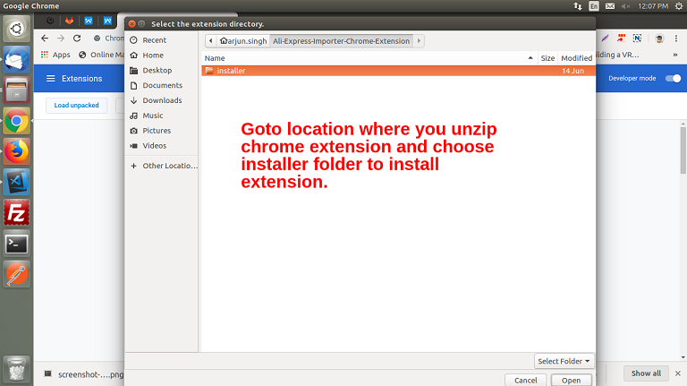
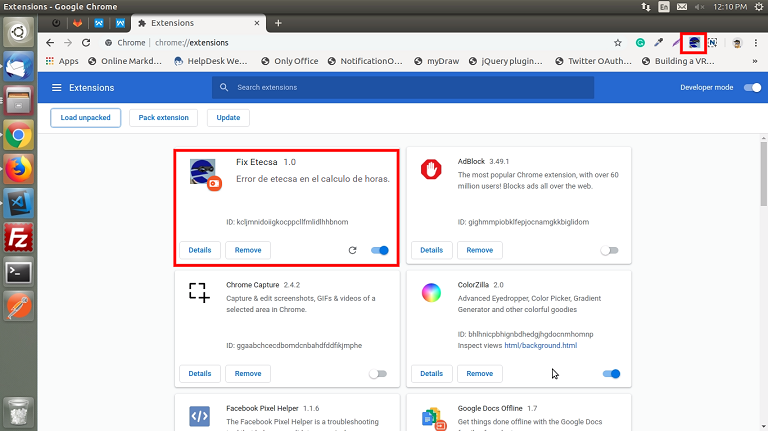
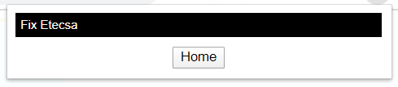
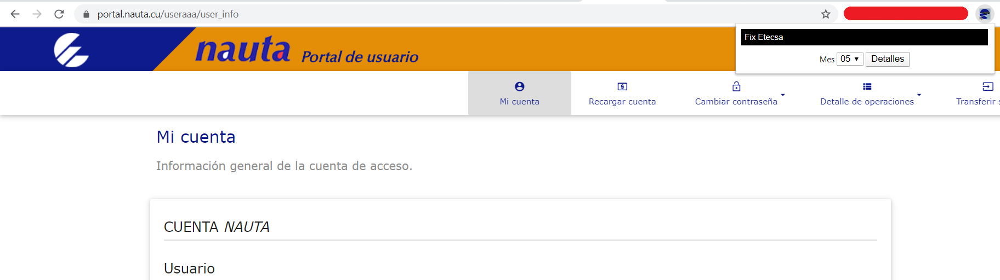
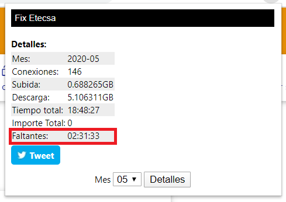

 

# Fix Etecsa - Extensión del Chrome

## Descripción

Esta extensión en particular se utiliza para conocer la cantidad de horas de la cuenta nauta se te han descontado de más por errores de ETECSA. Las extensiones son archivos que se encuentran empaquetados en uno solo, los cuales el usuario descarga e instala. Este empaquetado a diferencia de las aplicaciones web normales, no necesita depender de contenido web.

Tal como fue expuesto anteriormente, las extensiones permiten añadir funcionalidad a Chrome sin sumergirse profundamente en código nativo. Se pueden crear nuevas extensiones con tecnologías básicas con las que mayormente trabajamos los programadores en desarrollo web: HTML, CSS y Javascript.

## Instalación

 
 
 
 
 
 

## Running 

- Si se encuentra en una página diferente a la de Información general del Portal Nauta, la extensión le mostrara un boton Home el cual lo redirigira a Información general del Portal Nauta, es necesario estar autentificado en el Portal Nauta. 

 

- Si se encuentra en la página de Información general del Portal Nauta, le mostraara un combo donde puede seleccionar el mes y un boton detalle el cual al darle click muestra los detalles de la conexión de ese mes.

 

- Se le mostrará los detalles de la conexión del mes seleccionado anteriormente. El campo que mas nos llama la atención es el de Faltantes, que indica cuanto tiempo ETECSA le ha descontado ese mes de más. En el boton Tweet te redirige a tweet para que compartas con el mundo la cantidad de horas que no tuviste la oportunidad de disfrutar por errores de ETECSA.  

 

- ¡Esperemos que ETECSA arregle sus errores lo antes posible!

## Test

```bash
ToDo
```

## Docs

- [crear-extensiones-google-chrome](http://www.maestrosdelweb.com/crear-extensiones-google-chrome/)
- [developing-google-chrome-extensions](https://code.tutsplus.com/es/tutorials/developing-google-chrome-extensions--net-33076)
- [Tweet button](https://developer.twitter.com/en/docs/twitter-for-websites/tweet-button)
- [Automate Chrome Extension Deployment](https://www.akinjide.me/2019/automate-chrome-extension-deployment/)
- [Web Store Upload CLI](https://github.com/DrewML/chrome-webstore-upload-cli)
- [How to generate Google API keys](https://github.com/DrewML/chrome-webstore-upload/blob/master/How%20to%20generate%20Google%20API%20keys.md)


